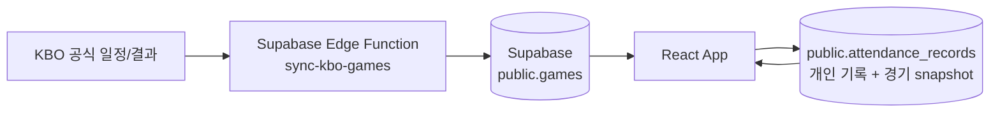

# ⚾ Ballog

### 야구장의 순간을 기록하다.

**KBO 야구팬을 위한 개인 직관 기록 및 통계 웹앱**

Ballog는 직접 관람한 경기를 나만의 기록으로 남기고, 응원팀 관점의 승패와 관람 패턴을 돌아볼 수 있는 야구 다이어리입니다. 실제 KBO 일정과 결과를 개인 기록에 연결해 경기 선택은 간편하게, 좌석·동행인·한줄평·별점은 오래 남길 수 있게 만들었습니다.

> 개인 포트폴리오 프로젝트이며 KBO 또는 각 구단의 공식·제휴 서비스가 아닙니다.


## 핵심 기능

### 📝 직관 기록

- 날짜별 실제 경기 선택과 팀·구장·시작 시간 자동 입력
- 좌석, 동행인, 한줄평, 별점 기록
- 경기별 상세 기록과 시즌별·결과별 목록 조회
- `game_id`가 없는 과거 수동 기록도 snapshot 정보로 표시

### ⚾ 실제 KBO 일정 연동

- KBO 공식 일정 데이터를 서버 측 collector에서 월 단위로 수집
- 브라우저는 KBO 사이트를 직접 호출하지 않고 Supabase만 조회
- `external_game_id` 기준 upsert로 경기 상태·점수·시간·구장 갱신
- 공식 경기 정보와 개인 관람 기록의 역할을 분리

### 📊 직관 통계

- 응원팀 관점의 승·무·패 및 무승부 제외 승률
- 홈·원정, 구장, 상대팀, 월, 요일별 기록
- 현재 연승·연패와 최고 연승
- 일정 표본 이상인 구장·상대팀의 최고 승률
- 미종료·취소·연기 경기는 승패 통계에서 제외

### 📅 직관 캘린더

- 월 단위 직관 기록과 W/L/D 표시
- 오늘 및 기록이 있는 날짜 강조
- 한 건은 상세 화면으로, 여러 건은 해당 날짜 목록으로 연결

### 🎨 개인화와 반응형 UI

- Supabase Auth 기반 회원가입·로그인
- 최초 응원팀 설정 및 10개 구단별 컬러 테마
- 모바일 하단 내비게이션과 데스크톱 사이드바

## 페이지 구성

| 경로 | 화면 |
| --- | --- |
| `/login`, `/signup` | 로그인 및 회원가입 |
| `/setup/team` | 최초 응원팀 설정 |
| `/` | 직관 요약, 최근 기록, 예정 경기 |
| `/records` | 직관 기록 목록과 필터 |
| `/records/new` | 실제 경기 선택 또는 수동 기록 추가 |
| `/records/:id` | 직관 기록 상세 |
| `/calendar` | 월별 직관 캘린더 |
| `/stats` | 직관 통계 대시보드 |
| `/profile` | 프로필 및 응원팀 변경 |

## 데이터 흐름



- `games`: collector가 관리하는 공식 경기 일정과 최신 결과
- `attendance_records`: 좌석, 동행인, 메모, 별점과 경기 snapshot
- 연결된 기록은 최신 화면에서 `games`를 우선 사용하고, 수동·과거 기록은 snapshot을 사용합니다.
- RLS를 통해 사용자는 자신의 profile과 직관 기록만 접근하며, 로그인 사용자는 `games`를 읽기만 할 수 있습니다.

collector는 먼저 KBO 일정 페이지에서 세션 쿠키를 얻고, 같은 세션으로 일정 endpoint에 form POST합니다. 상세 요청 구조, 배포와 예약 실행 방법은 [`docs/kbo-game-sync.md`](./docs/kbo-game-sync.md)를 참고하세요.

## Tech Stack

| 영역 | 기술 |
| --- | --- |
| Frontend | React, TypeScript, Vite, Tailwind CSS |
| Routing / UI | React Router, lucide-react |
| Backend | Supabase Auth, PostgreSQL, RLS |
| Collector | Supabase Edge Functions, Deno |

## 로컬 실행

Node.js 20 이상이 필요합니다.

```bash
npm install
cp .env.example .env.local
npm run dev
```

Supabase Dashboard에서 Project URL과 브라우저용 publishable key를 확인한 뒤 `.env.local`에 입력합니다.

```env
VITE_SUPABASE_URL=
VITE_SUPABASE_PUBLISHABLE_KEY=
```

서버 전용 `SUPABASE_SERVICE_ROLE_KEY`, `SYNC_KBO_SECRET`, Supabase personal access token은 `VITE_` 변수나 Git 추적 파일에 저장하면 안 됩니다.

```bash
npm run lint
npm run build
npm run preview
```

## Supabase 설정

- 새 프로젝트: SQL Editor에서 [`supabase/schema.sql`](./supabase/schema.sql) 실행
- 기존 프로젝트에 games 추가: [`supabase/migrations/20260902_add_games.sql`](./supabase/migrations/20260902_add_games.sql) 적용
- 로컬 collector 실행: 서버 전용 환경변수를 현재 셸에 설정한 후 아래 명령 실행

```bash
npm run sync:kbo:local -- 2026 9
```

Edge Function 배포와 `SYNC_KBO_SECRET` 설정은 [`KBO 경기 데이터 동기화 문서`](./docs/kbo-game-sync.md)를 따릅니다. 앱은 월별 수집 결과를 Supabase에서 조회하며, KBO 서버를 페이지 요청마다 호출하지 않습니다.

## 팀 로고

팀 이름, 테마 컬러와 로고 경로는 [`src/data/teamThemes.ts`](./src/data/teamThemes.ts)에서 중앙 관리합니다. 현재 `public/images/teams/` 파일은 placeholder이며 공식 로고가 아닙니다. 사용 권한이 확인된 자산을 같은 파일명으로 교체하면 `TeamLogo`를 사용하는 모든 화면에 반영됩니다.

## Roadmap

- [x] 회원가입·로그인과 profile 자동 생성
- [x] 응원팀 선택 및 팀 테마
- [x] 실제 KBO 일정 선택
- [x] 개인 직관 기록 CRUD
- [x] 공식 경기 결과 재동기화
- [x] 직관 통계 대시보드
- [x] 월별 직관 캘린더
- [ ] 사용 권한이 확인된 실제 구단 로고
- [ ] 직관 사진 및 티켓 이미지 업로드
- [ ] 구장 도장깨기
- [ ] 시즌 결산
- [ ] 공유용 직관 카드

## Screenshots

프로젝트 화면이 정리되면 이 섹션에 모바일·데스크톱 스크린샷을 추가할 예정입니다.

## 배포 참고

`BrowserRouter`를 사용하므로 배포 플랫폼에서 존재하지 않는 경로를 `/index.html`로 보내는 SPA rewrite가 필요합니다.
